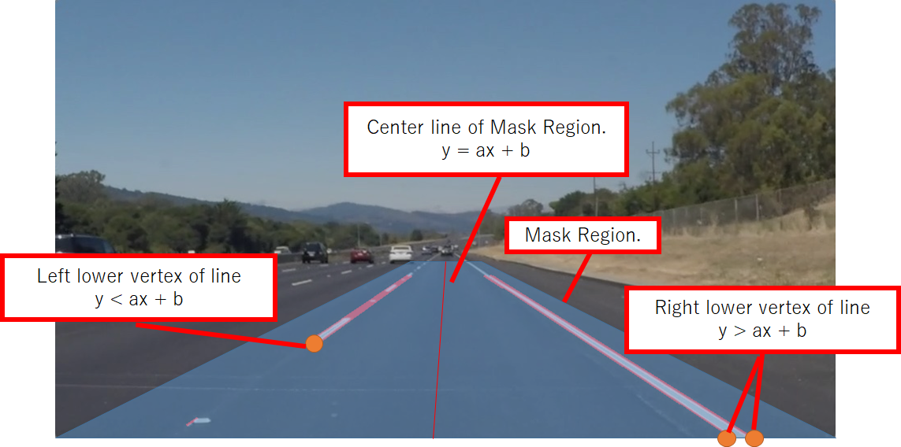
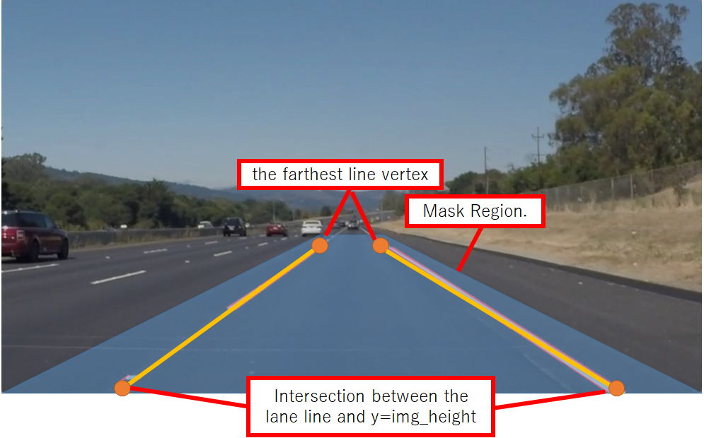

# **Finding Lane Lines on the Road** 

## Writeup

---

**Finding Lane Lines on the Road**

The goals / steps of this project are the following:
* Make a pipeline that finds lane lines on the road
* Reflect on your work in a written report

---

### Reflection

### 1. Describe your pipeline. As part of the description, explain how you modified the draw_lines() function.

My pipeline consited of 9 steps. 
the pipeline processings follows:

1. Convert fullcolor input image into a grayscale image.
2. Apply gaussian_blur to the grayscale image.
3. Detect edges by canny method.
4. Mask the edge image in the area of the road.
5. Detect hough lines from the masked edge images.
6. Classify the detected lines into the left lanes or the right lanes. (classify_lines)
7. Create one left lane with the average slope of the left lines 
   and passing the farthest line vertex. (detect_lines)
8. Create one right lane by the same way as the left one. (detect_lines)
9. Draw the left lane and right lane on the input image. (draw_lines)

In order to draw a single line on the left and right lanes.
I added two functions before the draw_lines(): classify_lines() and detect_line().

The classify_lines() function classifies the detected lines into the left lanes or the right lanes.
In order to decide left lane or right lane, this function use equations of position relation 
between a line and a points: the line is the center line of mask region, and the points are lower vertexes of line.
Figure 1 presents the equations for each positional relationship between the center line and lower edge vertexes.
When the center line's equation is y=ax+b, the equation of y<ax+b holds on left vertexes, and the equation 
of y>ax+b holds on right vertexes. I classified the lines into left or right lanes by checking the inequal equations.

Figure 1:

Next, the detect_line() function creates one lane line with the average slope of the lines and passing through the farthest line vertex. 
Because I need draw line from the farthest line vertex to image edge, I calculated the intersections by solving 
the simultaneous equations of the lane equation and y=img_height.
Figure 2 shows the farthest line vertex and the intersection between the lane line and the y=img_height.

Figure 2:

### 2. Identify potential shortcomings with your current pipeline

- Shortcoming 1
    * When the road mask area deviates from the actual road area, the pipeline cannot detect lanes correctly.
- Shortcoming 2:
    * When the road surface has noise such as shadows or cracks, the lane's slope is unstable 
      because the slope is calculated by using the edges other than the lane.

### 3. Suggest possible improvements to your pipeline

- Improvement 1
    * In order to solve the shortcoming 1, It is necessary to mask the edge image by using free space calculated 
      from pointcloud of Lidar, or road areas calculated from CNN for road scene segmentation.
- Improvement 2
    * In order to solve the shortcoming 2, I need to transform the input RGB image into HSV space image,
      and mask the image with hue so that only yellow and white pixels remain.
